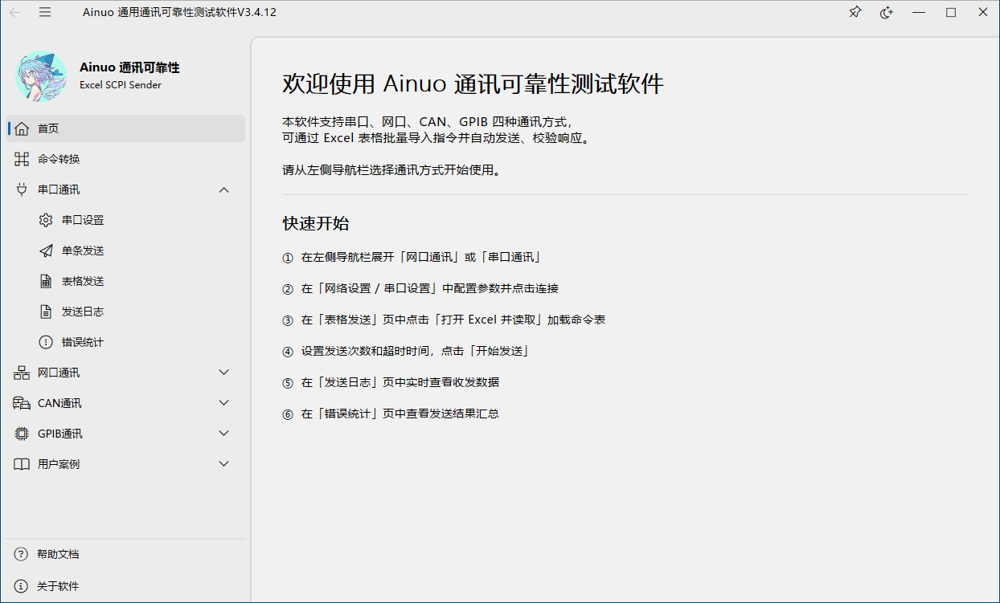

# Ainuo 通用通讯可靠性测试软件

[](https://github.com)
[](https://www.qt.io/)
[](LICENSE)

一款基于 Qt 的**多协议仪器通讯自动化测试工具**，支持通过 Excel 表格批量发送 SCPI 指令，自动校验设备返回值，统计通讯可靠性。

<p align="center">
  
</p>

---

## ✨ 功能特性

| 模块 | 说明 |
|------|------|
| 🔌 **串口通讯** | RS-232 / RS-485，波特率/数据位/停止位/校验位可配置，支持 HEX/ASCII 模式 |
| 🌐 **网口通讯** | TCP 客户端，支持 Nagle 算法禁用（低延迟），静默超时断开 |
| 🔬 **GPIB 通讯** | 基于 NI-VISA，支持板卡号/主副地址配置、发送后缀(无/CR/LF/CRLF)、EOI 信号、结束字符控制、连接超时保护 |
| 🚗 **CAN 通讯** | 预留接口，后续版本完善 |
| 📊 **Excel 批量发送** | 读取 .xlsx 命令表，自动逐条发送、校验响应、标记超时/内容错误 |
| 📝 **单条命令调试** | 独立发送页，实时查看收发日志（毫秒级时间戳） |
| 📈 **错误统计** | 6 列详细错误列表（序号/时间/类型/命令/期望值/实际值），颜色区分超时(橙)与内容错误(红) |
| ⏱️ **精确延时** | 1ms 精度命令间隔控制，EMA 误差补偿算法，计时起点在 I/O 前（TX→TX 间隔 = max(I/O耗时, 设定延时)） |
| 🧵 **多线程架构** | I/O 操作独立工作线程，UI 完全无阻塞 |
| 🎨 **现代 UI** | 基于 ElaWidgetTools 的 Fluent Design 风格，支持明暗主题切换 |

---

## 🛠️ 技术栈

- **语言:** C++11
- **框架:** Qt 5.15.2
- **编译器:** MinGW 8.1 (64-bit)
- **构建系统:** CMake 3.10+
- **UI 组件:** [ElaWidgetTools](https://github.com/Liniyous/ElaWidgetTools)（Fluent Design 风格）
- **Excel 引擎:** [QXlsx](https://github.com/QtExcel/QXlsx)（跨平台 .xlsx 读写）
- **GPIB 驱动:** NI-VISA（NI-488.2 或独立运行时）

---

## 📁 项目结构

```
ExcelSCPISender/
├── CMakeLists.txt                   # CMake 构建配置
├── README.md
├── development/
│   ├── Serial_T/                    # 串口通讯模块
│   │   ├── SerialPage.h/.cpp        #   串口 UI 页面
│   │   ├── SerialWork.h/.cpp        #   串口工作线程
│   │   └── SerialExcel.h/.cpp       #   串口 Excel 批量发送
│   ├── Network_T/                   # 网口通讯模块
│   │   ├── NetworkPage.h/.cpp       #   网口 UI 页面
│   │   ├── NetWorkWork.h/.cpp       #   网口工作线程
│   │   └── NetworkExcel.h/.cpp      #   网口 Excel 批量发送
│   ├── GPIB_T/                      # GPIB 通讯模块
│   │   ├── GPIBPage.h/.cpp          #   GPIB UI 页面
│   │   ├── GPIBWork.h/.cpp          #   GPIB 工作线程（NI-VISA）
│   │   └── GPIBExcel.h/.cpp         #   GPIB Excel 批量发送
│   ├── CAN_T/                       # CAN 通讯模块（预留）
│   │   ├── CANPage.h/.cpp
│   ├── USER_T/                      # 用户管理模块
│   │   ├── USERPage.h/.cpp
│   ├── Other_T/                     # 核心 / 公共组件
│   │   ├── MainPage.h/.cpp          #   首页 / 帮助 / 关于页面
│   │   ├── ElaWidgetToolsDemo.h/.cpp#   主窗口入口
│   │   ├── LED.h/.cpp               #   状态指示灯组件
│   │   ├── StatCard.h/.cpp          #   统计卡片组件
│   │   └── main.cpp                 #   程序入口
│   ├── Old/                         # 历史遗留代码
│   ├── ico/                         # 应用图标资源
│   └── ExcelSCPISender.qrc          # Qt 资源文件
├── QXlsx/                           # QXlsx 子模块（Excel 读写）
└── ElaWidgetTools/                  # ElaWidgetTools 子模块（UI 组件库）
```

---

## 🚀 快速开始

### 环境要求

| 依赖 | 版本 | 说明 |
|------|------|------|
| Windows | 10 / 11 (64-bit) | 开发与运行平台 |
| Qt | 5.15.2 | 需包含 `SerialPort`, `Network`, `AxContainer` 模块 |
| CMake | ≥ 3.10 | 构建系统 |
| MinGW | 8.1 (64-bit) | 编译器 |
| NI-VISA | 最新版 | **仅 GPIB 模块需要**，[免费下载](https://www.ni.com/en/support/downloads/drivers/download.ni-visa.html) |

### 克隆项目

```bash
git clone --recurse-submodules https://github.com/your-username/ExcelSCPISender.git
cd ExcelSCPISender
```

> 项目包含 QXlsx 和 ElaWidgetTools 子模块，务必使用 `--recurse-submodules`。

### 构建

**方式一：CLion（推荐）**

1. 用 CLion 打开项目根目录
2. 在 `CMakeLists.txt` 中确认 Qt 和 NI-VISA 路径正确：
   ```cmake
   set(CMAKE_PREFIX_PATH "D:/Apps/Work/Qt/5.15.2/mingw81_64")
   set(VISA_INCLUDE_DIR "C:/Program Files (x86)/IVI Foundation/VISA/WinNT/include")
   set(VISA_LIB_DIR "C:/Program Files (x86)/IVI Foundation/VISA/WinNT/lib_x64/msc")
   ```
3. 选择 `Release-MinGW` 工具链 → 构建

**方式二：命令行**

```bash
mkdir build && cd build
cmake .. -G "MinGW Makefiles" \
  -DCMAKE_PREFIX_PATH="D:/Apps/Work/Qt/5.15.2/mingw81_64"
cmake --build . --target untitled -j 14
```

### 运行

构建成功后，在构建目录下运行 `untitled.exe`。首次运行会自动执行 `windeployqt` 部署 Qt 运行时 DLL。

---

## 📖 使用指南

### 1. 连接设备

- **串口:** 设置 → 选择端口号 / 波特率 → 打开串口
- **网口:** 设置 → 输入 IP / 端口 → 连接网络
- **GPIB:** 设置 → 输入板卡号 / 仪器地址 → 选择发送后缀 → 打开 GPIB

> 连接成功后对应 LED 指示灯变为**绿色**。

### 2. 单条命令发送

在「单条发送」页面直接输入 SCPI 命令（如 `*IDN?`），点击发送，实时查看返回结果。

### 3. Excel 批量发送

1. 点击 **「下载示例模板」** 获取标准 Excel 文件
2. 按模板填写命令表：

   | 发送的命令 (A) | 正确的返回值 (B) | 到下一条命令的时间ms (C) |
      |---------------|-----------------|------------------------|
   | `*IDN?` | 期望的返回值 | 50 |
   | `MEAS:VOLT:DC?` | （留空=不校验） | 200 |

3. 点击 **「打开 Excel 并读取」** 加载文件
4. 设置 **发送次数**（0 = 无限循环）和 **超时时间**
5. 点击 **「开始发送」** 启动批量测试
6. 在 **「发送日志」** 和 **「错误统计」** 页面实时监控

> 💡 **设置命令（无回复）:** 对于 `*RST`、`CONF:VOLT:DC 10` 等设备不回复的设置命令，只需将 B 列留空，软件会自动识别并在 Work 层 emit 空响应，仅按 C 列延时后立即发送下一条。查询命令（如 `*IDN?`）在 B 列填写期望值即可自动校验。

### 4. 读取返回值模式

点击 **「读取返回值」**，软件仅发送一轮命令，并将仪器的实际返回值自动填入 Excel B 列（用于快速建立期望值模板）。

### 5. GPIB 发送后缀说明

GPIB 设置页中新增「发送后缀」下拉框，支持以下选项：

| 后缀选项 | 实际追加字节 | 适用场景 |
|---------|-------------|---------|
| 无 (None) | 不追加任何字节 | 仪器仅靠 EOI 硬件信号识别命令结束 |
| CR (`\r`) | 0x0D | 少数仪器使用回车符作为命令终止符 |
| LF (`\n`) | 0x0A | **大多数 SCPI 仪器**使用换行符终止命令 |
| CRLF (`\r\n`) | 0x0D 0x0A | 部分仪器要求回车+换行双字符终止 |

> **注意：** 如果 Excel 命令列中已包含 `\n`，软件会自动去除末尾的 `\r`/`\n` 后再追加所选后缀，避免重复。建议 Excel 中不写 `\n`，统一通过后缀选项控制。

---

## 🏗️ 架构设计

```
┌─────────────────────────────────────────────────────┐
│  主线程 (GUI Thread)                                 │
│  ┌──────────┐  ┌────────────┐  ┌─────────────────┐  │
│  │ UI 响应   │  │ XxxExcel   │  │ 校验 + 错误记录  │  │
│  │ 按钮/表格 │  │ 流程控制    │  │ (信号驱动)      │  │
│  └──────────┘  └────────────┘  └─────────────────┘  │
│       ↑              ↑↓ QueuedConnection    ↑        │
│       │              │         │            │        │
├───────┼──────────────┼─────────┼────────────┼────────┤
│  工作线程 (Work Thread)  │         │            │        │
│  ┌────────────────────┴─────────┴────────────┴─────┐ │
│  │  发送 → 接收 → 精确延时 → emit 信号              │ │
│  │  (阻塞 I/O，不阻塞 UI)                           │ │
│  └─────────────────────────────────────────────────┘ │
└─────────────────────────────────────────────────────┘
```

- **XxxPage:** 页面 UI 创建 + 信号连接管理
- **XxxWork:** 独立工作线程中的 I/O 操作（串口/网口/GPIB），负责 forceRead 判断 + 精确延时
- **XxxExcel:** 主线程中的批量发送流程控制 + 校验逻辑
- **线程通讯:** 所有跨线程调用使用 `QMetaObject::invokeMethod(Qt::QueuedConnection)`

---

## 📦 依赖与致谢

| 库 | 说明 | 链接 |
|---|------|------|
| **ElaWidgetTools** | 现代化 Fluent Design UI 组件库 | [GitHub](https://github.com/Liniyous/ElaWidgetTools) |
| **QXlsx** | 高性能跨平台 Excel 读写库 | [GitHub](https://github.com/QtExcel/QXlsx) |
| **NI-VISA** | GPIB / 仪器控制驱动 | [NI 官网](https://www.ni.com/en/support/downloads/drivers/download.ni-visa.html) |

---

## 📝 更新日志

### V3.4.8 (2026-07)

- 🔧 **串口/网口 `sendStringWithDelay` 架构对齐 GPIB：** 新增 `forceRead` 参数，设置命令（B 列为空 + 非捕获模式）的识别逻辑从 Excel 层收归 Work 层处理，三模块架构完全统一
- ⚡ **串口/网口精确延时计时起点前移：** 高精度计时器在 `write` 之前启动（对齐 GPIB），TX→TX 实际间隔 = max(I/O 耗时, 设定延时)，消除额外累积偏差
- 🔧 **串口/网口 Excel 批量发送流程统一：** 始终启动超时定时器，设置命令由 Work 层 emit 空响应驱动 `m_gotReply=true`，消除 Excel 层的特殊分支判断（`m_expectData.isEmpty() && !m_isCaptureMode`）
- 🔇 **网口连接超时/错误弹窗静默化：** `QMessageBox` 弹窗改为 `qDebug()` 静默日志，批量发送时不再被弹窗中断用户操作
- 📐 **三模块 `sendStringWithDelay` 函数签名统一**：SerialWork / NetworkWork / GPIBWork 均采用 `(text, hexMode, expectedResponse, delayMs, forceRead)` 五参数签名

### V3.4.7 (2026-07)

- 🐛 **修复串口/网口 Excel 批量发送中设置命令卡死问题：** 当 B 列（预期返回值）为空且非捕获模式时，自动识别为"无回复设置命令"，跳过等待回复，仅按 C 列延时后直接发送下一条命令。对齐 GPIB 模块已有行为
- ✨ 串口/网口批量发送优化：设置命令不再启动全局超时计时器，避免无意义的超时等待
- 📝 使用指南补充设置命令（无回复）与查询命令的使用说明

### V3.4.6 (2026-07)

- ✨ GPIB 设置页新增「发送后缀」选择（无/CR/LF/CRLF），解决部分仪器必须收到换行符才响应的问题
- ✨ 发送数据自动 unescape：输入框和 Excel 命令列中的 `\r` `\n` 字面量自动转换为真实控制字符
- ✨ 智能去重：发送前自动去除命令末尾已有的 `\r` `\n`，再追加所选后缀，避免重复终止符
- 🐛 修复 GPIB 命令中 `\n` 作为字面量字符发送而非换行符的 Bug（导致部分仪器不响应查询命令）

### V3.4.5 (2026-07)

- 🐛 修复 GPIB 精确延时偏差 10ms 的 Bug（计时起点从 viRead 之后移到 viRead 之前）
- 🐛 修复串口/网口 `waitForBytesWritten(10)` 引入 10ms 额外延迟（改为 1ms）
- ✨ 全模块日志/表格支持 `\r\n` 显示为可见字符 `\r\n`（不再被解释为换行）
- ✨ 全模块捕获模式：`\r` `\n` 在 Excel B 列中存储为 `\\r` `\\n`，读取时自动还原为真实字节
- ✨ 全模块 `bytesToDisplayText()` 控制字符转义（错误日志表格不再异常换行）
- 🔧 串口延时 0ms 修复（`delayMs <= 0` → `delayMs < 0`）

### V3.4.4 (2026-07)

- 🐛 修复 GPIB 单条发送无回传数据显示的 Bug
- 🐛 修复 GPIB 表格发送中设置命令导致 `doVISARead` 阻塞超时的 Bug
- 🐛 修复串口表格发送延时 0ms 被强制覆盖为 100ms 的 Bug
- ⚡ GPIB 设置命令间隔从 ~1.5s 降至 ~2ms

### V3.4.1 (2026-07)

- ✅ GPIB 模块完整实现
- ✅ 精确延时 EMA 误差补偿算法
- ✅ 界面优化：GroupBox 分组布局、卡片样式


---

## 📄 许可证

MIT License. 详见 [LICENSE](LICENSE) 文件。

---

## 👤 作者

**Cossiant**

- 2026 年 7 月
- Qt 5.15 + MinGW

---

<p align="center">
  <sub>Made with ❤️ for instrument automation testing</sub>
</p>
```